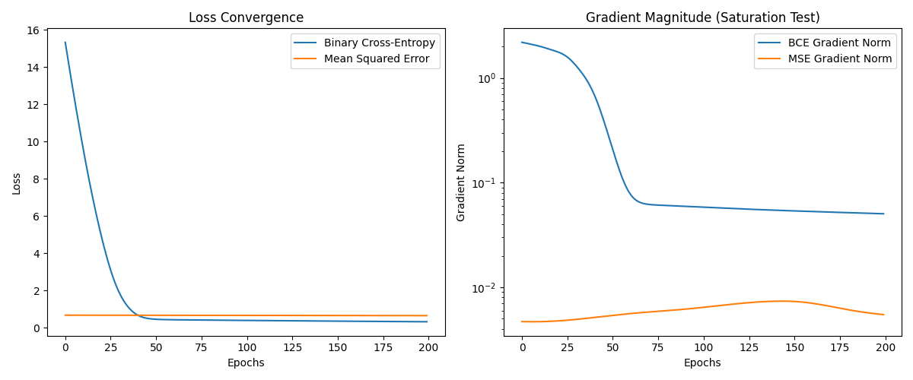

# 📌 Loss Function Behaviour in Neural Network Optimization


---

## 🧠 Overview

This project presents an experimental analysis of loss function behaviour in neural networks, focusing on how different loss functions affect:

- Gradient flow  
- Training stability  
- Convergence dynamics  

---

## 🚀 Objective

To compare:

- Binary Cross-Entropy (BCE)  
- Mean Squared Error (MSE)  

under saturated neuron conditions, where vanishing gradients are most likely to occur.

---

## 🧪 Motivation

Loss functions are often treated as simple evaluation metrics, but they fundamentally shape the optimization process.

This project demonstrates that:

> The choice of loss function directly affects gradient propagation and learning efficiency.

---

## ⚙️ Tech Stack

- Python  
- TensorFlow  
- NumPy  
- Matplotlib  
- Scikit-learn  

---

## 🧪 Experimental Design

This experiment intentionally creates a challenging learning scenario:

- High weight initialization → forces neuron saturation  
- Activation: tanh (prone to saturation)  
- Optimizer: SGD (learning rate = 0.1)  
- Dataset: make_moons  

### 📈 Metrics Tracked

- Loss convergence over epochs  
- Gradient norm of output layer  

---

## 📊 Results

### Loss Convergence & Gradient Behaviour

<p align="center">
  
</p>

---

## 🔍 Observations

- BCE maintains strong and stable gradients  
- MSE suffers from rapid gradient vanishing  
- MSE struggles to learn under saturation  
- BCE enables consistent optimization  

---

## 🧠 Key Insight

Binary Cross-Entropy provides better gradient flow than Mean Squared Error in classification tasks, especially under saturation.

---

## 📈 Why This Matters

- Explains why BCE is standard in classification problems  
- Provides empirical evidence, not just theory  
- Demonstrates how loss functions affect optimization  

---

## ▶️ How to Run

```bash
git clone https://github.com/YOUR_USERNAME/loss-function-behaviour-nn.git
cd loss-function-behaviour-nn

python -m venv tf-env
tf-env\Scripts\activate   # Windows

pip install -r requirements.txt
python main.py
